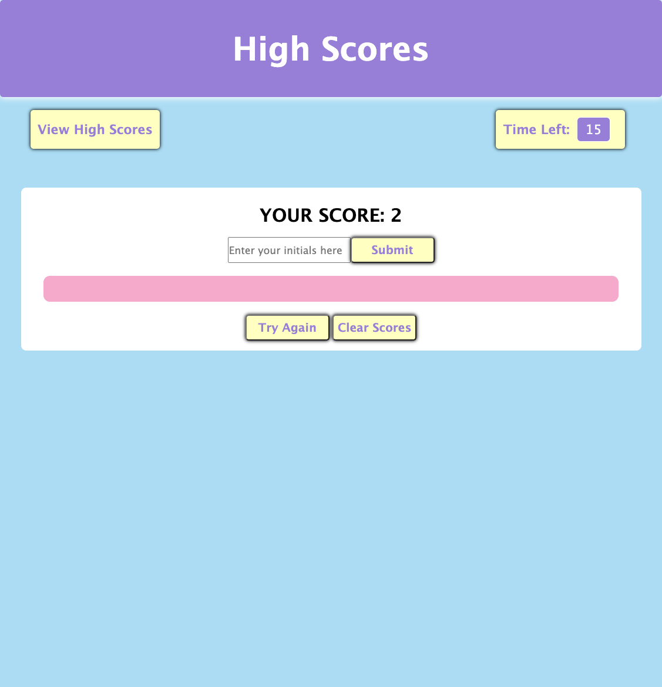

# 04 Web APIs: Code Quiz

## Description

* This is a timed quiz on JavaScript fundamentals that stores high scores that can be viewed after completing the quiz. 
* When the start button is clicked, the timer in the upper right hand corner will start to countdown from 60 seconds. 
* When a question is answered, the next question pops up automatically. 
* If a question is answered correctly, "Correct!" will pop up on the screen. 
* If a question is answered incorrectly, "Incorrect!" will pop up on the screen and 5 seconds will be subtracted from the timer. 
* You get one point for each correct answer. The highest score possible is 5.
* When all questions are answered or the tiner reaches 0, then the game is over. 
* The user will then be prompted to save their score along with their initials. 

## Link to application

* Link to the deployed application: [Click Here](https://mich-hales.github.io/coding-quiz/)
* Link to the GitHub repository: [Click Here](https://github.com/mich-hales/coding-quiz)

## Screenshot of application

